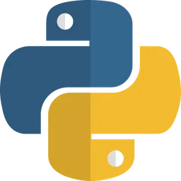
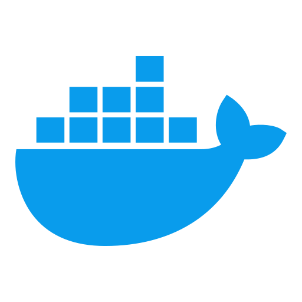

<h1>Hi, I'm Mohamed Ramos</h1>

<picture> 

</picture>

<pre>
📠Graduated in Computer Science at <a href="https://tec.mx/en">Tecnologico de Monterrey</a>
💻 I'm a Junior <strong>Full-Stack Web Developer</strong>
🧠 Always <strong>learning </strong>learning and <strong>improving</strong> skills
🗣 Bilingual in <strong>Spanish </strong> (native) and <strong>English</strong>
🚀 Open to new <strong>job opportunities</strong>.
📄 Check out my <a href="./resume/CV MRN English.pdf">resume</a>

</pre>

##  ğŸ› ï¸ Skills

###  💻 Programming languages: 
  
  
  

### âš™ï¸  Framework : 
 

 

### ğŸ–¥ï¸ Technologies :  
  
  
  
  

